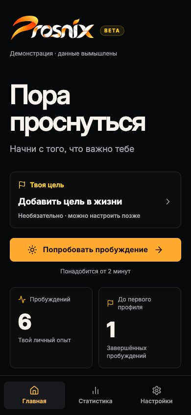
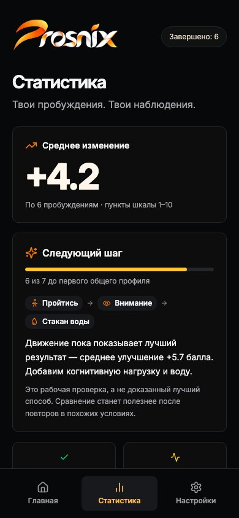
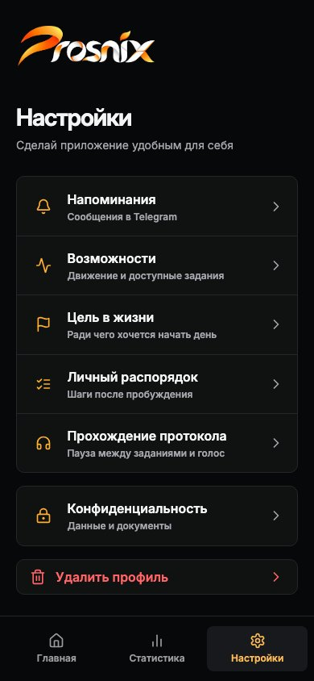

# Prosnix

Prosnix — Telegram Mini App для пробуждения после сна. Приложение предлагает короткую
последовательность заданий и помогает отслеживать, как меняется бодрость после их выполнения.

Идея проекта — попробовать разные способы начать день и сравнить собственные результаты.
Перед протоколом и после него пользователь оценивает состояние по шкале от 1 до 10,
а через 15 минут получает вопрос о том, удалось ли окончательно проснуться.

## Возможности

- Протоколы после ночного и дневного сна, а также для короткой перезагрузки без сна.
- Задания на внимание, реакцию и память, простые упражнения и бытовые действия.
- Подбор последовательности с учётом доступных упражнений, времени и предыдущих сессий.
- Замена задания и досрочное завершение, если пользователь уже проснулся.
- Режим без телефона с голосовыми подсказками и переходом по таймеру.
- Напоминания, история пробуждений и статистика изменения бодрости.
- Персональный отчёт с необязательным объяснением от DeepSeek. Без API-ключа доступен базовый отчёт.

Проект экспериментальный: наблюдения помогают сравнивать собственные сессии, но не доказывают
эффективность упражнений. Приложение не предназначено для медицинской диагностики.

## Скриншоты

<p>
  
  
  
</p>

На скриншотах демонстрационные данные.

## Технологии

- **Клиент:** TypeScript, React 18, Vite 6, Tailwind CSS 4.
- **API:** Node.js, Fastify 5, TypeBox.
- **База данных:** PostgreSQL 17, Drizzle ORM.
- **Интеграции:** Telegram Bot API / Mini Apps, DeepSeek API.
- **Тесты:** Vitest, Testing Library, Playwright.
- **Инструменты:** pnpm workspace, Docker Compose, GitHub Actions, Prettier, Gitleaks.

## Быстрый запуск демо

Понадобятся Node.js **22–24** и pnpm **11.19.0**.

```bash
git clone --branch dev https://github.com/kostin-five/prosnix.git
cd prosnix
pnpm install --frozen-lockfile
pnpm dev:demo
```

Откройте `http://localhost:5190/`. Демо работает без Telegram, базы данных и API-ключей.
Оно использует вымышленные сессии и не отправляет данные на сервер.

Для статической сборки демо:

```bash
pnpm build:demo
```

Готовые файлы находятся в `apps/web/dist-demo`.

## Запуск с API и базой данных

Дополнительно нужен Docker. Для входа через Telegram создайте собственного тестового бота
и заполните настройки в `.env` по шаблону [.env.example](.env.example).

```bash
cp .env.example .env
pnpm db:start
pnpm db:migrate
pnpm dev
```

- Web: `http://localhost:5190/`.
- API: `http://localhost:3001/health`.

Для открытия Mini App в Telegram нужен HTTPS-адрес; подробнее — в
[инструкции по настройке](docs/telegram-mini-app-setup.md).
DeepSeek необязателен. Токены и секреты храните в `.env`, не добавляйте их в Git или переменные `VITE_*`.

## Структура проекта

```text
apps/web           React-приложение
apps/api           API, авторизация и внешние интеграции
packages/domain    Правила сессий, подбор протоколов и аналитика
packages/db        Схема PostgreSQL, миграции и репозитории
packages/contracts Общие схемы запросов и ответов
tests              Браузерные сценарии
docs               Документация проекта
```

Доменные правила отделены от интерфейса и базы данных. Сервер проверяет авторизацию,
переходы сессии и повторные запросы; аналитика рассчитывается из сохранённых оценок.

## Проверки

```bash
pnpm verify:release  # форматирование, типы, unit-тесты и сборка
pnpm test:e2e        # мобильные браузерные сценарии
pnpm test:demo       # проверка автономного демо
```

Для интеграционных тестов нужна отдельная локальная тестовая БД с применёнными миграциями.
Подготовка и команды описаны в [руководстве по тестированию](docs/testing.md).

## Лицензия

[MIT](LICENSE). Сведения об иллюстрациях, шрифте и сторонних материалах — в
[ASSET_LICENSES.md](ASSET_LICENSES.md).
